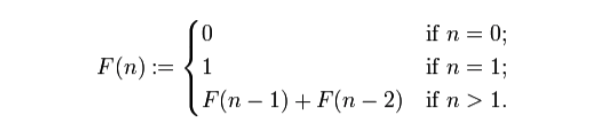
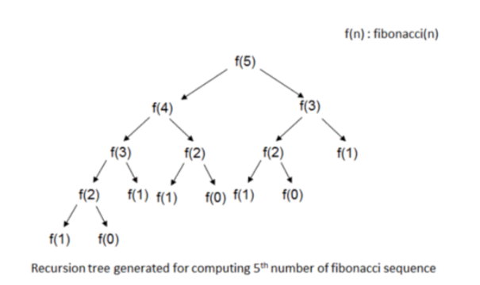

#Dynamic Programming
###피보나치 수열

<br>
- 점화식을 가지고 있다
- n이 1 이하일 때 값이 특정된다. 
- 이보다 클 경우 바로 전 2개의 항의 값에 영향을 받게 된다. 
```java
public class Fibonacci {
    public static void main(String[] args) {
        int input = 8; // 8개 출력
        for (int i = 1; i <= input; i++) {
            System.out.println(fibo(i));
        }
    }
    public static int fibo(int n) {
        if (n <= 1)
            return n;
        else
            return fibo(n-2) + fibo(n-1);
    }
}
```
 <br>
기하급수적으로 늘어나는 호출 횟수 때문에 f(N)을 구하는 데는 적어도 다항 시간을 벗어난, 지수 시간 시간복잡도가 발생. <br>
###Memoization
피보나치 함수에서 먼저 dp[n]을 계산한 적이 있는지 확인하고 (-1이 아닌지 확인) >> 계산한 적이 있다면 추가 재귀 호출이<br>
없이 그 값을 바로 리턴됨<br>
>  한 번 계산했던 값은 두 번 다시 계산할 필요가 없게 되므로 f(n)을 구하는데 O(N)의 시간만 필요하게 됨. <br>

https://blog.naver.com/kks227/220777103650 >> dp문제 모음 